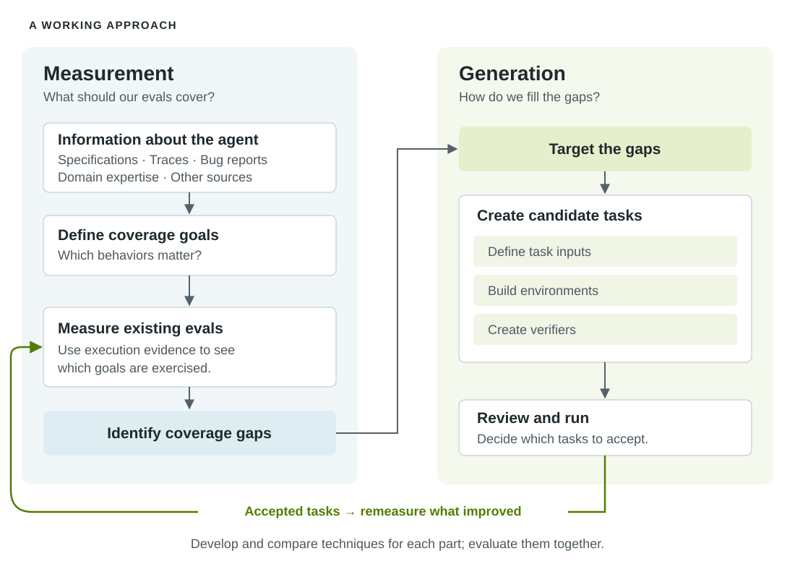

<!-- SPDX-FileCopyrightText: Copyright (c) 2026 NVIDIA CORPORATION & AFFILIATES. All rights reserved. -->
<!-- SPDX-License-Identifier: Apache-2.0 -->

# Introducing Eval Author

Helping developers build the evaluations that make agents work.

**October 8, 2026 · Introduction · Draft**

<!-- Author byline to be added before publication. -->

## Hello, world!

Hello from the Eval Author team! We're working on making it easier for
developers to create useful evaluations for their agents and understand where
those evaluations fall short.

We therefore think agentic evaluations are at the core of building good
agents. They turn domain expertise and expectations into something we can
test, tell us whether a change helps or hurts, and provide the feedback signal
for optimization. If we're asking an agent to improve its own prompts, tools,
or code, its evaluations help determine what "better" means. We want to make
that feedback something developers can trust.

Our objective is to help developers (1) understand whether their agentic evals
are "good" with respect to their agent and (2) create new evals as needed!

Doing this well across different agents and domains is still an open problem,
and a big one at that. A coding agent, a customer-service agent, and an
engineering design agent have different responsibilities, environments, and
definitions of success. Generating evals for software as complex as modern AI
agents is challenging along many axes.

We're therefore committed to working with the open-source community and
building in public. Dev Notes is where we'll share our latest announcements,
research, and lessons learned. Our latest work will be shared in our Eval
Author research repo.

## Introducing Eval Author

[Eval Author](../../../README.md) is our test bed for exploring how to
understand and create agentic evals. We want to bring together promising
techniques for measuring and generating evals, try them on concrete case
examples, and turn what we learn into tools developers can use.

Understanding and generating agentic evals is a _big problem_, and we're
therefore decomposing the work into a few connected problems: deciding what an
evaluation set should cover; measuring how well it covers those goals; and
generating tasks to fill the gaps. Each gives us something we can study and
improve independently, then combine with the other pieces.

To learn whether these ideas work, we need good case examples: agents with
meaningful work to do, environments where we can run them, and existing
evaluations we trust enough to use as a reference. We also need variety. An
approach that helps a coding agent might need something quite different to
work for an engineering design agent.

We don't yet have the range of case examples or the benchmarks for eval
generation that we'd like. Building that collection is part of the research,
and a reason we're interested in working with teams who bring real agents,
domain expertise, and evaluation problems of their own.

## Breaking Down the Problem

Our working approach separates **measurement** from **generation**.

*One way to break down eval authoring. Each stage is a place to develop and
compare approaches; the loop lets us study how they work together.*

On the **measurement side**, we define _coverage goals_ that we expect our
eval set to meet. Specifications, traces, bug reports, and domain expertise
can help us define coverage goals: tools used, capabilities displayed, failure
cases addressed, etc. Measuring existing evals against those goals gives us
gaps to investigate. Both the way we define goals and the metrics we use to
measure them are things we want to experiment with.

On the **generation side**, those gaps give us a target. Here as well, we want
to decompose the problem, e.g., breaking task creation into defining the
input, constructing the environment, and creating the verifier that checks
success. We then review and run candidate tasks, returning accepted tasks to
measurement to see what improved.

This is a starting approach for our work. It gives new approaches a place to
fit: we can try a different source of coverage information, a new metric, or
another technique for building environments without rebuilding all the
tooling. We can work on each problem independently, then evaluate the impact
of each piece individually, eventually identifying the most effective combined
approach against our case examples.

At present, our current implementation is focused on spec-based coverage,
where we define the behavior of the agent in semi-formal language and then
generate coverage goals against this specification. Generation then produces
Harbor tasks, leveraging existing coding agent CLIs to build the evaluation.
Initial results are promising, demonstrating that Eval Author, for the small
number of case examples we've tested it against, outperforms a raw, unguided
coding agent. We plan to expand our studies and share these results in a
future dev note. Our initial implementation is available in the repository.

## Questions for Study

**Where should coverage goals come from?** Specifications, production traces,
bug reports, observed failures, and human expertise each tell us something
different about what an agent should be able to do. We want to understand
which sources are most useful, how to combine them, and what they leave out.

At present, our current implementation uses a simple structured natural
language specification. We plan to integrate production traces as an
additional source of goals.

**How should we generate evaluations that test what matters?** We're exploring
how to break eval authoring into manageable parts and combine techniques for
creating tasks, environments, and checks. One problem we continually see with
coding agents is optimizing for “greenness”: making the evals pass by making
the task easier or weakening what it checks. This is undesirable, typically,
as optimizing for greenness runs contrary to the goals of an evaluation.

We want to understand how to keep generation focused on the missing behavior,
even when that behavior doesn't exist, without losing that dogged effort that
makes coding agents so useful.

**How should we evaluate eval-generation techniques?** We need case examples,
benchmarks, and measures that let us compare approaches and understand their
limitations. Benchmarks for evaluating agents across various domains are
widely available. Benchmarks for _creating evals_—aka benchmarks for creating
benchmarks—are extremely sparse. The creation of an Eval Author benchmark is
high on our to-do list and would create an open method of comparing proposed
approaches.

## Parting notes

We're just getting started. These dev notes are where we'll share our
experiments, the case examples we're building, and the lessons we learn along
the way. If you're building agents and wrestling with how to evaluate them,
we'd like to hear from you.
