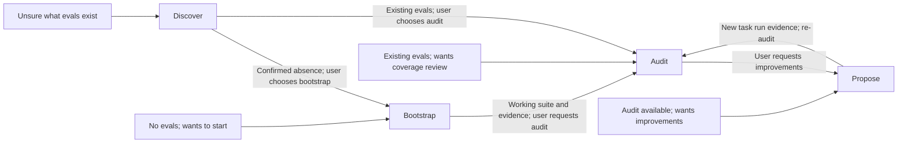

<!-- SPDX-FileCopyrightText: Copyright (c) 2026 NVIDIA CORPORATION & AFFILIATES. All rights reserved. -->
<!-- SPDX-License-Identifier: Apache-2.0 -->

# Eval Author P0 release flows and behavior test plan

Status: proposed release acceptance contract. Based on repository revision
`578f327`, reviewed 2026-09-18. This document defines what we need to prove before
release; it does not claim these behaviors have passed or implement the tests.

## Release outcome

A user can start with an agent and no evals, understand the evals already in a
repository, assess their coverage against intended behavior, and create useful
new evals from the gaps. At every step, they understand what was produced, what
the evidence establishes, and what to do next.

These are four entry experiences, not four mandatory onboarding steps:

| Experience | User's starting point | Success in the user's words | Main deliverables |
| --- | --- | --- | --- |
| **Bootstrap** | “My agent has no evals. Help me get started.” | “I have an Ethos and a few meaningful evals. I understand what they check, have results for my agent, and can rerun them.” | Local `ETHOS.md`, starter plan, Harbor tasks and job config, control results, agent baseline, rerun instructions. |
| **Discover** | “Does this repository have evals, and how do I run them?” | “I know what I have, how to run it or what is missing, and whether bootstrap or audit is the right next step.” | Inventory with source paths, run guidance, search limits, and a next-step recommendation; readiness evidence when requested. |
| **Audit** | “Help me understand the coverage of my existing evals.” | “My Ethos describes what matters. I know what is tested, what the available evidence supports, and where the weaknesses are.” | Reused or newly reviewed Ethos, validated `audit.md`, evidence-linked coverage report, prioritized gaps and unknowns. |
| **Propose** | “Use this audit to help me close coverage gaps.” | “I can choose a useful proposal and get a runnable Harbor task whose new run evidence can close the selected gap on re-audit.” | Ranked proposals, selected task drafts and run instructions; validation and before/after coverage evidence when creation and execution are requested. |

`ETHOS.md` is the canonical filename for the intended-behavior document in this
plan. Reuse the user's applicable existing path and content. An Ethos describes
the agent's intended behavior; `audit.md` defines the finite set of requirements
against which coverage is measured.



Unknown or inaccessible eval locations remain unresolved; they are not evidence
that no evals exist. A request for multiple flows authorizes their handoffs without
asking the user to repeat that request.

## Shared P0 expectations

- **Start in the right place.** Honor the requested outcome and reuse supplied
  paths, previous answers, existing Ethos, and completed work. An audit request
  does not trigger the full bootstrap interview.
- **Guide the user to a concrete result.** Explain unfamiliar concepts as they
  become relevant, ask focused questions where intent is missing, and make
  decisions reviewable through saved artifacts. Preserve answered check-ins and
  existing authorization when resuming.
- **Keep claims tied to evidence.** Distinguish a plan, documented run instructions,
  validated configuration, completed task controls, actual agent results, and
  measured coverage. None substitutes for the others.
- **Keep scope and intent intact.** Work in `.eval-author/` plus the selected local
  Ethos path. Do not change the agent implementation, existing scoring, or
  intended behavior to make results look better. Preserve user edits.
- **Make blocked progress useful.** Name the missing input, the work it prevents,
  and the next action. Missing tools or traces must not produce fabricated
  readiness, results, or coverage. A partial result is labeled partial.
- **Keep setup proportional.** Local intent capture and inventory need no NeMo
  account, upload, production trace, or inference call. Installation and live
  execution follow the user's actual authorization; inventory and proposal-only
  requests do not imply permission to run an evaluation.

All behavior cases below are proposed P0 acceptance cases. “Pass” means the skill
performed the required behavior, which can include correctly reporting a blocker
or an agent failure. It does not mean the evaluated agent received a high score.

## 1. Bootstrap: from no evals to a useful, repeatable starter suite

### User flow

1. Accept the user's stated absence of evals and show the guided path:
   **Understand your agent → Get Harbor ready → Draft your first evals →
   Get the evals running → Run and review**. Explain the result the user will get.
2. Read the agent's relevant documentation, identify its purpose and boundaries,
   and ask only for missing intent. Reuse a substantive applicable Ethos, or help
   create and review a local `ETHOS.md` before designing cases.
3. Explain Harbor's role and establish available tooling. Missing Harbor can
   leave setup pending while the user chooses to continue independent planning.
4. Help the user choose a small starter set, normally two or three scenarios:
   a representative success and a meaningful variation or expected failure.
   For each, explain the request, starting state, observable outcome, grading
   rule, and Ethos requirement. Settle the scope before building it.
5. Create native Harbor task drafts, fixtures, verifiers, and reference solutions.
   Prepare the environment and connect the user's actual agent. Explain each
   case's grading limits, including incorrect behavior it would miss.
6. Validate the task/configuration using Harbor and exercise task controls.
   Show that the reference solution meets the declared criteria and an
   appropriate negative control does not receive undeserved credit.
7. Run the authorized starter suite against the actual agent. Explain each case's
   results and errors, provide the exact rerun command and result paths, and show
   how to change or extend one case. Save progress for the next visit.

### Overall success and acceptance evidence

The selected starter cases execute through a validated configuration and record
results for the user's actual agent. The user can connect each case to an Ethos
requirement, understand its grading and limitations, and repeat the run without
rediscovering setup. A low agent score is a useful baseline, not a reason to
weaken the verifier. Plans or control-only runs are useful partial deliverables,
but do not satisfy the complete bootstrap outcome.

Expected artifacts: `ETHOS.md` or the selected existing path;
`.eval-author/first-eval.md`; `.eval-author/task-drafts/`;
`.eval-author/first-eval.yaml`; and retained results under `.eval-author/jobs/`.

### Behavior test cases

| ID | Given / when | Required observable behavior | Acceptance evidence |
| --- | --- | --- | --- |
| B01 — Correct welcome | No evals or Ethos; user asks to get started. | Select bootstrap immediately, explain the five visible steps, and begin guided intent capture after the opening response. Do not demand traces, an audit, or a scan to prove the user's stated absence. | Opening response and tool-call order; no premature setup or task creation. |
| B02 — Meaningful Ethos | Agent docs identify capabilities but omit a decision about intended behavior; user answers and reviews the draft. | Explain Ethos, ask about the missing intent, save a substantive local document, and use the reviewed content before case design. Do not infer intent solely from current code. | Saved document, structural/parser checks, transcript of the missing-intent answer and review, references in the case plan. |
| B03 — Reuse and preserve | An applicable Ethos has custom sections and previously answered setup questions. | Reuse it without restarting the interview; preserve custom content and proceed from the earliest unfinished milestone. | Before/after file comparison and conversation assertions. |
| B04 — Choose useful cases | Reviewed Ethos contains several workflows; user selects a small subset. | Produce a manageable plan with Ethos links, observable success criteria, a meaningful failure example, fixtures, and grading limits for each selected case. Explain what remains outside the starter set. | Plan contents and semantic rubric; no claim of comprehensive coverage. |
| B05 — Complete and rerun | Supported agent integration and working Harbor/backend are available; selected task creation and runs are authorized. | Create and validate the selected tasks/config, complete controls, run the actual agent, and provide commands that rerun the same selected set and expose results. | Native validator results, task files, rewards and exceptions for every selected case, plus a fresh rerun in a reset test workspace. |
| B06 — Setup is blocked | Harbor is absent, or the backend/agent access fails at its relevant stage. | Name the specific blocker; preserve completed work and independently useful planning. Do not install without authorization or mark the whole flow complete. Never substitute another agent for the user's agent. | Tool transcript, saved partial state, accurate next action, no invented runtime evidence. Run variants for missing Harbor, unavailable backend, and missing agent integration. |
| B07 — Honest grading and results | An unconditional verifier, a valid “do nothing” scenario, or a low-scoring real agent is encountered. | Reject unconditional credit; use a wrong-action control when inaction is correct. Repair task defects without relaxing intended behavior. Report genuine agent failures as results. | Separate fixture variants with control rewards, verifier changes, and truthful baseline explanation. |
| B08 — Resume unfinished work | The user returns after scope selection or after some tasks were validated. | Reuse reviewed intent, selected cases, setup evidence, and answered check-ins; complete remaining work. Revalidate evidence affected by changed inputs. | Saved stage and artifacts, no duplicate task slugs, unchanged completed work where inputs match, correct completed/remaining case counts. |

## 2. Discover: know what exists and how to proceed

### User flow

1. Inspect supplied locations and relevant README, evaluation docs, runners, CI,
   and likely eval directories. Identify what actually evaluates agent behavior.
2. Describe each relevant suite or source: location, scenarios it tests, framework,
   config/dataset, and available run instructions. Include non-Harbor material.
3. Give the working directory, command, dependencies, and required credential
   variable names when available. Mark instructions as documented or
   source-derived until readiness is checked.
4. If asked whether Harbor evals are ready, use Harbor's own validation ladder.
   Report per-config readiness, required failures, skipped/dropped tasks, and
   unknowns. Do not run the suite as part of inventory or readiness checking.
5. Save a discovery report and recommend the next step: bootstrap for confirmed
   absence, audit for existing evals, or resolve location/access when uncertain.
   Finish the requested inventory before offering another experience.

### Overall success and acceptance evidence

The user can answer “What evals do I have?”, “What do they test?”, “How would I
run them, and what is unverified?”, and “What should I do next?”. No Ethos or
runtime setup is required merely to answer the inventory question. A clearly
explained missing command or inaccessible source is an honest limitation, not
a reason to invent instructions.

Expected artifact: `.eval-author/discovery.md`, including evidence and search
limits; provider JSON for a readiness assessment when performed.

### Behavior test cases

| ID | Given / when | Required observable behavior | Acceptance evidence |
| --- | --- | --- | --- |
| D01 — Existing suite | Repository has documented Harbor tasks/configs; user asks what exists and how to run it. | Inventory the relevant suites, explain representative behaviors, give sourced run instructions, and offer audit. Do not require Ethos first. | Report checked against a fixture inventory and documented commands; no live job invocation. |
| D02 — No evals | Bounded inspection finds no agent evals and the user confirms none exist elsewhere. | Explain the search scope, distinguish ordinary unit tests from agent evals, and recommend bootstrap. | Fixture inventory, confirmation, and next-step response. |
| D03 — Non-Harbor evals | A script/dataset suite exists but no Harbor configs do. | Explain and preserve the existing suite, provide its available run guidance, and offer audit with evidence limits. Do not claim absence or silently convert it. | Known script/dataset paths in the report; no fabricated Harbor readiness or conversion. |
| D04 — Unknown location | Docs point to another repository, inaccessible directory, or ambiguous set of suites. | Record the unresolved source and ask a focused location/selection question. Do not report “no evals” or guess which suite the user meant. | Search findings and question matched to the fixture. |
| D05 — Readiness is unproven or fails | User asks whether a Harbor suite can run; Harbor is unavailable, or a config has an invalid task/backend/required variable. | Preserve inventory; label unproven checks and required failures accurately. Keep per-config verdicts separate and identify silently dropped tasks. | Harbor output or failed import evidence; comparison with expected required/advisory checks. Use distinct fixture variants. |
| D06 — Respect the handoff | Inventory succeeds; user requested inventory only, or explicitly requested discovery followed by audit. | Stop after findings and offer a next step in the first variant; carry paths and findings into audit without asking for the same authorization again in the second. | Transcript and tool-call scope for both request variants. |

## 3. Audit: intended behavior, tested behavior, and weaknesses

### User flow

1. Start from the selected existing evals and the audit request. Explain what the
   available tasks, verifiers, traces, and judgments can establish.
2. Locate an applicable Ethos or guide local creation and review. Establish intended
   behavior independently of the existing tests; resolve material conflicts.
3. Turn that intent into a finite, inspectable `audit.md` with stable requirement
   identifiers for relevant tools, capabilities, and failure cases. Validate it
   using the bundled schema/validator and explain the coverage denominator.
4. Inspect the selected evals to explain what their scenarios and verifiers test.
   Measure available compatible ATIF evidence against the audit requirements,
   using supported judgment evidence where applicable. Keep static inspection,
   observed tool use, and judgments about outcomes distinguishable.
5. Summarize covered items, measured gaps, unmeasured items, contradictions, and
   verifier weaknesses. Link each conclusion to the requirement and evidence,
   prioritize by user impact, and explain the next action.
6. Save a reusable report with source identities and commands for remeasurement.
   Offer proposals, or continue if improvements were already requested.

### Overall success and acceptance evidence

The user understands the intended behavior, the finite scope being measured,
which selected evals exercise it, and the most consequential weaknesses.
Coverage claims can be traced to compatible evidence. A tool appearing in a trace
does not establish that the resulting answer is correct; a passing existing
test does not establish that its verifier is strong.

With no usable traces, deliver the validated denominator, static findings, and
an evidence-collection plan. Label trace coverage unmeasured. That is a useful
partial audit, not a completed measurement or proof that every item is uncovered.

Expected artifacts: applicable Ethos; `.eval-author/audit.md`; generated
measurements and reports under `.eval-author/`; source/evidence references;
prioritized findings distinguishing measured gaps from missing evidence.

### Behavior test cases

| ID | Given / when | Required observable behavior | Acceptance evidence |
| --- | --- | --- | --- |
| A01 — Guided complete audit | Existing evals and valid traces are supplied, but Ethos is missing. | Guide local Ethos creation/review, define and validate the denominator, measure evidence, and explain the important gaps without restarting bootstrap. | Reviewed Ethos, validator result, measurements, report, and direct route to audit. |
| A02 — Intent exceeds current tests | Ethos describes a required workflow absent from all existing evals. | Retain that requirement in the denominator and surface the missing coverage; do not rewrite intent to match current tests. | Ethos diff, requirement IDs, gap evidence, explanation of user impact. |
| A03 — Mixed evidence states | Fixtures include covered/uncovered tools, a measured capability missing required judgments, a measured failure case with a prohibited call, and a report where only tools were measured. | Mark the capability and failure case uncovered with their reasons; label kinds never measured as unmeasured. Positive subjective judgments cannot override deterministic requirements. | Exact expected statuses/counts by kind and semantic checks on the explanation; run separate evidence variants. |
| A04 — Missing or invalid evidence | Traces are absent/malformed, judgments refer to older trace bytes, or coverage reports use incompatible audit identities. | Save useful valid work, name the evidence defect, and explain recovery. Reject incompatible aggregation and avoid invented percentages or gap claims. | Validator errors, report status, and absence of fabricated measurements; separate fixture variants. |
| A05 — Weak verifier | A task passes while its verifier ignores a required outcome or rewards incorrect behavior. | Explain the verifier weakness with a concrete counterexample and distinguish it from whether the behavior was exercised. | Task/verifier source references, known counterexample, and evidence-linked finding. |
| A06 — Reproducible accounting | Several compatible reports overlap on the same requirements. | Aggregate without double-counting requirements; preserve provenance and produce the same deterministic accounting when remeasured. | Expected unique item counts, audit identity, linked evidence, repeat measurement. |
| A07 — Useful conclusion | Audit has several findings of different consequence. | Prioritize findings against Ethos and user impact, explain what each proposed action would establish, and stop at audit unless follow-up was requested. | Report with stable gap IDs and rationale; no unauthorized task creation or suite execution. |
| A08 — Preserve reviewed scope | An existing audit has user-edited requirements and custom prose; intended behavior changes. | Reconcile additions/conflicts explicitly, preserve reviewed content, and identify measurements made stale by denominator changes. Do not silently drop difficult items to improve coverage. | Before/after audit diff, stable unaffected IDs, reported conflicts, and correct evidence invalidation. |
| A09 — Coverage is not reliability | One compatible run covers a capability and another exhibits a failure. | Report aggregate coverage and the observed failure separately; do not translate union coverage into “every run succeeds.” | Both run references, expected aggregate counts, and retained weakness in the findings. |

## 4. Propose: turn an audit gap into a useful Harbor task

### User flow

1. Load the selected audit, denominator, and evidence. Check that findings are
   applicable to the current inputs. Missing or stale evidence is a prerequisite
   to resolve, not a reason to pretend the user is starting without evals.
2. Propose a short ranked set of improvements. Each names a requirement/gap ID,
   user impact, scenario, starting fixture, expected outcome, grading approach,
   runtime requirements, and exactly what a future re-audit would need to observe.
   Label evidence-collection suggestions separately from measured coverage gaps.
3. Let the user choose among concrete proposals. A recommendation-only request
   ends here; an explicit creation request continues within its authorized scope.
4. Use Harbor's native scaffolder to create the selected supported task draft.
   Preserve the original requirement and add a meaningful verifier and reference
   solution. Provide an explicit config or inclusion command for the selected
   task without changing the user's existing suite unasked.
5. Validate the task and prove the reference solution. For authorized execution,
   collect independent actual-agent runs and their ATIF evidence, then measure
   against the same audit denominator.
6. Explain the before/after result. A task may be created but not validated,
   validated but not yet exercised, exercised without closing the gap, or proven
   to close the selected measured gap. State which occurred and provide rerun
   and re-audit instructions.

### Overall success and acceptance evidence

For **proposal-only**, the user can understand and choose actionable,
evidence-grounded improvements. For **creation**, the selected Harbor task is
valid, runnable in its supported environment, and explicitly mapped to the gap.
For **verified closure**, new run evidence satisfies the selected requirement
when measured against the unchanged denominator, while previous coverage is
retained. Merely adding files cannot turn an uncovered item into a covered one.

The complete release demonstration must include creation and re-audit, not just
good recommendations. Current task creation handles one eligible measured tool
gap at a time. Capability/failure-case authoring is a scope decision to resolve
before promising general gap closure; recommendations already span those areas.

Expected artifacts: ranked proposals under `.eval-author/`; task drafts and
README/inclusion commands; validation and Oracle results; authorized agent-run
results and ATIF; before/after measurements; final accepted/rejected status with
evidence. Preserve the existing suite and denominator.

### Behavior test cases

| ID | Given / when | Required observable behavior | Acceptance evidence |
| --- | --- | --- | --- |
| P01 — Actionable proposals | Valid audit contains missing scenarios, observed agent failures, and unmeasured areas; user asks for recommendations. | Distinguish task additions, agent repair, and evidence collection. Rank proposals with requirement IDs, evidence state, user impact, scenario, grading criteria, and a closure predicate. Preserve existing failing cases as regressions; stop before scaffolding or execution. | Proposal rubric, source gap IDs, preserved regression cases, and absence of new task/job writes. |
| P02 — Resolve missing inputs | The referenced audit is missing or predates relevant Ethos/task changes. | Identify or regenerate the needed audit evidence within the requested scope, then resume proposals. Do not invent gap IDs or restart bootstrap. | Input identity checks, focused recovery step, and traceable proposal sources. |
| P03 — Create the selected task | An actionable measured tool gap is chosen and task creation is requested. | Use Harbor scaffolding, create a complete task/verifier/reference solution, validate it, and prove Oracle behavior. Explain how to include exactly that task in a run. | Native scaffold/validator output, task artifacts, Oracle rewards, selected gap mapping, and explicit task selection. |
| P04 — Prove closure | The draft is validated and independent agent runs are authorized. | Complete at least two real-agent repeats without exceptions, each earning the intended verifier reward and separately covering the target against the same denominator. Retain passing task proof and compare aggregate coverage before/after. | Real-agent trial/reward evidence, distinct ATIF run IDs and measurement reports, compatible audit identity, and no loss of previously covered IDs. A pipeline acceptance flag alone is insufficient. |
| P05 — Do not claim false closure | Task files exist, Oracle fails, the agent never exercises the target, or the same run is supplied twice. | Report the actual stage and reject a closure claim; explain the failed condition and the next repair. Do not change the denominator or fabricate fresh runs. | Negative fixture variants for each condition; preserved evidence and explicit rejected/pending status. |
| P06 — Unsupported or unmeasured gap | The chosen capability/failure-case gap lacks a supported task-creation path, or measurement itself is missing. | Explain the limitation and offer a concrete supported next action. Do not disguise evidence collection as proven gap closure or manufacture a tool gap. | Accurate proposal type and status, unchanged gap identity, no claimed task creation for unsupported types. This boundary pass does not prove broad authoring support. |
| P07 — No actionable gaps | Audit has no eligible uncovered items, or an existing task already addresses the requested proposal. | Explain the evidence, avoid duplicate task creation, and identify remaining unmeasured/quality questions when present. Do not promise complete evaluation quality from coverage alone. | Zero unnecessary new tasks, stable requirement counts, and explanation grounded in the report. |

## Cross-flow acceptance journeys

Component cases do not prove that the user can complete the product journey.
These journeys retain the same workspace, intent, and artifacts across steps.

| ID | Journey | Required outcome |
| --- | --- | --- |
| J01 | No evals → bootstrap → rerun → audit | The first suite produces real results; its Ethos and run evidence carry into audit without a repeated interview. Repeated execution uses reset fixtures and produces fresh result paths. |
| J02 | Unknown repository → discover → audit | Inventory makes the suite understandable; after the requested handoff, audit reuses source paths and intent while preserving the limits of discovery evidence. |
| J03 | Audit → proposals → selected task → new runs → re-audit | The exact selected gap changes from measured uncovered to covered; the denominator and prior coverage remain stable. The user can reproduce the comparison. |
| J04 | Pause/block → resume in any flow | Saved work and decisions survive; the next step is correct, unrelated work is preserved, and affected evidence is refreshed when inputs change. |

## Turning the cases into SkillEvaluator tests

### What is already present

The repository's [SkillEvaluator integration](skill-evaluation-ci.md) has
advisory Tier 1 package checks, Tier 2 analysis, and bounded Tier 3 live evaluation.
The current [`eval-author` dataset](../skills/eval-author/evals/evals.json) contains
four routing cases that do not execute the downstream experiences. The other
authored dataset covers `mlflow-to-atif`, outside these four P0 flows.

The [live collector](../tools/collect_live_skill_evaluations.py) currently limits
each skill to four cases and one attempt, uses default grading, and runs OpenCode
in Docker. It does not supply the complete sibling-skill/runtime arrangement
needed to prove these journeys. Current advisory scores are not release evidence
for completing any of these four flows.

[SkillEvaluator](https://github.com/NVIDIA/SkillEvaluator) supports authored
datasets and Tier 3 agent evaluation. The repository pins version 0.2.1 at
`7e189c6bdada8910dfa1684f25feedca87f2db85`. That pin already supports custom graders
(`evals/grader.py` or `.sh`), custom grading modes, native Harbor tasks, and group
workspaces. The collector forces `--grading-mode default` and
`--skill-workspace-mode isolated`; enabling those capabilities requires collector
changes, not just dataset configuration. See the pinned
[configuration implementation](https://github.com/NVIDIA/SkillEvaluator/blob/7e189c6bdada8910dfa1684f25feedca87f2db85/src/skillevaluator/tier3/evals_config.py).

### Test layers and fixtures

1. **Conversation checkpoints:** Evaluate route selection, explanations, focused
   questions, proposal quality, truthful claims, and handoffs. Use a semantic
   rubric for these; do not require one exact sentence. Stage-specific fixtures
   may include established prior answers and reviewed artifacts.
2. **Artifact and execution checks:** Check files, schema results, selected task
   identities, commands actually run, rewards, exceptions, audit compatibility,
   and coverage changes deterministically. Use real Harbor validators. Mocks
   support error-path tests but cannot prove a working Harbor flow.
3. **Complete journeys:** Run J01–J04 with a controlled user-response script and
   persistent workspace. Exercise real transitions, rather than only telling
   the agent that every prior stage succeeded.

Use small synthetic repositories with declared ground truth:

| Fixture | Contents and purpose |
| --- | --- |
| F01 — Fresh agent | Documented, runnable toy agent; no evals or Ethos; scripted intent answers and a small stable runtime. Supports B01–B08 and J01. |
| F02 — Existing suites | Known Harbor tasks plus docs, configs, helper unit tests, and variants with non-Harbor evals or inaccessible references. Supports discovery and J02. |
| F03 — Audit evidence | Reviewed Ethos, validated denominator, task/verifier sources, synthetic compatible ATIF traces, supported judgment sidecars, and exact expected coverage. Supports audit. |
| F04 — Selected gap | F03 plus one known uncovered tool requirement, a solvable scenario, and a controlled actual agent integration. Supports creation and J03. |
| F05 — Broken/partial states | Variants with missing dependencies, invalid config/ATIF, stale audit identity, duplicate runs, weak verifiers, and interrupted workflow state. Supports negative and recovery cases. |

For a concrete shared fixture, use a local support agent with a synthetic refund
policy: answer a documented eligibility question, ask for a missing purchase
date, and escalate an exception through a local `escalate_case` tool. Bootstrap
selects the first two scenarios; the audit retains escalation as intended behavior;
the proposal adds a task that must create the expected escalation record. Calling
the tool without creating the correct record must fail the task's outcome check.

Fixtures must record exact expected item IDs/counts and preserve a clean reset
state. Keep the test harness's graders, expected reports, reference answers, and
hidden assertions out of the evaluated agent's starting workspace. Eval Author
can author and inspect its generated task's `solution/solve.sh`; that solution
must remain hidden from the downstream agent being evaluated by that task.
Grade actual outcomes and artifact changes, not an agent's statement that a
step succeeded.

### Case definition and grading contract

When implementing each table row, record:

- Stable case ID and variant; owning skill or skill group; fixture version.
- User prompt and any initial conversation state; the scripted user answers and
  authorizations available at each checkpoint.
- Positive observable assertions, forbidden claims/actions, and required
  artifact/tool/result evidence.
- Runtime requirements and timeout; exact pass/fail rules; retained report and
  trace paths. A missing dependency is a failure of execution infrastructure,
  unless that missing dependency is the intentional input of a recovery case.

Use supported native dataset fields rather than adding custom fields to
`evals/evals.json`. Keep planning metadata in a companion manifest if it does
not belong in the installed schema. This checkpoint example follows the current
checked-in dataset structure; it tests the opening only:

```json
{
  "skill_name": "eval-author",
  "evals": [
    {
      "id": "B01-bootstrap-opening",
      "prompt": "My agent has no evals and no ETHOS.md. Help me get started. First show me the guided plan, then wait for my reply.",
      "expected_output": "A guided first-eval plan with the five visible steps, starting with understanding the agent and local Ethos. Wait for the user before repository work.",
      "assertions": [
        "Selects the bootstrap experience without requiring an existing audit or traces.",
        "Shows Understand your agent, Get Harbor ready, Draft your first evals, Get the evals running, and Run and review as a progress checklist.",
        "Explains that intended behavior is established through local Ethos before cases are designed.",
        "Waits for the user's reply without claiming files were created or checks ran."
      ],
      "expected_skill": "eval-author",
      "files": []
    }
  ]
}
```

Place eventual datasets in the appropriate skill's `evals/` directory and check
them with the pinned tool, for example:

```bash
skillevaluator tier3 validate skills/eval-author --json
```

For the existing integration, a keyless plan is available now:

```bash
python3 tools/collect_live_skill_evaluations.py --output /tmp/p0-release-plan
```

Use a fresh output directory outside the checkout. Follow the
[live-run instructions](skill-evaluation-ci.md#reports-and-local-checks) for
authorized execution. These commands validate/plan the current datasets; they
do not run the unimplemented acceptance catalog in this document.

### Harness work required before these are release checks

- Add reviewed fixtures and datasets for first-eval, discovery, audit, and task
  creation, plus the router's handoffs. Map each case and journey ID to an
  executable test; do not substitute the current four routing cases.
- Stage the required sibling skills and references together in the evaluated
  workspace. Keep the baseline arm free of the skill instructions being tested.
- Add deterministic artifact checks and retain evidence needed to inspect each
  assertion. Default model grading alone does not establish native validation,
  fresh execution, or coverage closure.
- Implement or verify a conversation driver that supplies answers only after
  the expected user checkpoint. The native case contract provides one `prompt`,
  with no scripted `turns` or user-reply field; keep dialogue scripts outside
  `evals.json` and execute them through the added driver. Checkpoint tests are
  useful until then, but cannot be counted as complete journeys. See the pinned
  [dataset schema](https://github.com/NVIDIA/SkillEvaluator/blob/7e189c6bdada8910dfa1684f25feedca87f2db85/src/skillevaluator/tier3/evals_spec.py)
  and [Harbor adapter](https://github.com/NVIDIA/SkillEvaluator/blob/7e189c6bdada8910dfa1684f25feedca87f2db85/src/skillevaluator/tier3/harbor/adapter.py).
- Provide an isolated runtime in which the evaluated skill can actually use
  Harbor and its supported backend/agent integration. Account explicitly for
  nested execution inside Tier 3; do not assume Docker is available merely
  because the outer evaluator uses it. Separate missing-runtime results from
  behavior failures. Keep SkillEvaluator's Harbor 0.13.2 environment isolated
  from this repository's development Harbor 0.20.0.
- Expand case selection beyond the collector's four-case limit, add repeated
  trials, and define a dedicated release gate. Record case-level assertions and
  complete/incomplete states, not just mean scores or with/without-skill lift.
  Update summary parsing alongside execution: it currently requires one attempt
  and counts expected/scored attempts against the number of cases.

## Proposed release gate and remaining decisions

The following is a proposed sign-off policy, not the current CI configuration:

1. Every P0 case/variant above is implemented and traceable to its ID. Every
   required deterministic assertion passes. Cases cannot silently disappear
   because of selection limits or missing fixtures.
2. Every conversation case and complete journey passes three independent trials
   on the declared release agent/model/runtime, with no critical behavioral
   failure in those trials. This is a regression gate, not a reliability estimate.
3. Every happy-path journey has real execution evidence for the applicable
   validators, controls, actual agent runs, reruns, and measurements. A correct
   blocked-path response cannot stand in for a missing happy-path demonstration.
4. Unknown, skipped, incomplete, timed-out, or unrun required checks block
   sign-off. Positive average scores or skill lift cannot offset a failed P0.
5. Review a complete bootstrap and audit-to-closure journey for whether a user
   can explain what was tested, understand the limits, and rerun it from the
   delivered instructions. Retain the transcript, artifacts, exact source and
   fixture revisions, model/runtime settings, and case-level results.

Acceptance applies to the with-skill arm. The without-skill baseline and measured
lift are diagnostic comparisons, not a requirement that the baseline fail or a
substitute for absolute acceptance.

Resolve these scope and implementation decisions before calling the gate ready:

| Decision / gap | Why it matters | Proposed disposition |
| --- | --- | --- |
| Which agent integrations and execution backends ship as supported? | A working demonstration on a toy fixture does not prove every user's agent can connect. | Declare the initial supported matrix and run the full journeys on each supported path; report unsupported integrations accurately. |
| Does P0 task creation include capability and failure-case gaps? | Current creation supports measured tool gaps only; the broad “close my coverage gaps” promise is wider. | Either implement and test the additional paths or explicitly limit the release promise to supported measurable gaps. Do not count P06 as proof those tasks can be authored. |
| How are guided conversations executed in SkillEvaluator? | Single-turn routing tests cannot prove content review, checkpoint handling, or resumption. | Add a conversation driver and journey fixtures; keep staged checkpoint results separately labeled. |
| How are generated artifacts and nested runs graded? | An eloquent response can conceal missing or broken task files. | Add deterministic checks and a deliberate runtime design alongside semantic grading. |
| When does advisory evaluation become a release requirement? | Existing workflow success does not mean P0 experiences passed. | Keep the bounded advisory smoke runs and add an explicit release acceptance job/report with the rules above. |
| Are skill instructions internally consistent? | Task-create currently says failure cases are unmeasured in v1, while audit supports failure-case measurement. | Reconcile that statement before using it as a test oracle; keep measurement support separate from automatic task-authoring support. |

Recommended implementation order: fixture ground truth and checkpoint cases;
deterministic artifact checks and supported runtime; complete bootstrap and
audit-to-closure journeys; then the release gate and full declared runtime matrix.

## References

- [Eval Author routing and evidence standard](../skills/eval-author/SKILL.md)
- [Local Ethos procedure](../skills/eval-author/references/local-ethos.md)
- [Guided milestone and resumption behavior](../skills/eval-author/references/milestone-checkins.md)
- [First-eval workflow](../skills/eval-author-first-eval/SKILL.md)
- [Discovery workflow](../skills/eval-author-discover/SKILL.md)
- [Audit workflow](../skills/eval-author-audit/SKILL.md)
- [Proposal and task-creation workflow](../skills/eval-author-task-create/SKILL.md)
- [Current SkillEvaluator CI and evidence limits](skill-evaluation-ci.md)
- [NVIDIA SkillEvaluator](https://github.com/NVIDIA/SkillEvaluator)
